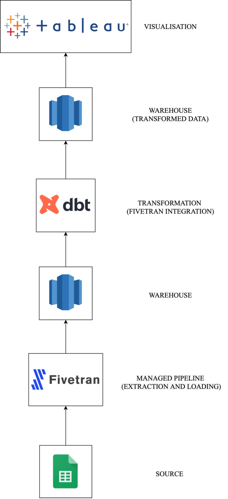

# Data Injestion with Fivetran

This repo contains a dbt project which handles data transformations for a data injestion case study utilising [Fivetran](https://www.fivetran.com/).

NB: Transformation used can be found [here](https://github.com/AfolabiAwonuga/data_ingestion/blob/main/models/my_dbt_transforms/o_d_dbt_view_model.sql)

## Case study
The [case study]() explores a hypothetical scenario in which a small business is looking to leverage the power of analytics to gain insights and make data-driven decisions. With Fivetran, the business is able to set up and maintain data pipelines with minimal effort, as the platform is fully managed. This will allow the business to focus on their core competencies, rather than dedicating resources to managing and maintaining data pipelines. 

## Data Architecture

  

## Tech Stack

- Google sheets 
- Fivetran 
- AWS Redshift 
- Data build tool (Dbt)
- Tableau 
